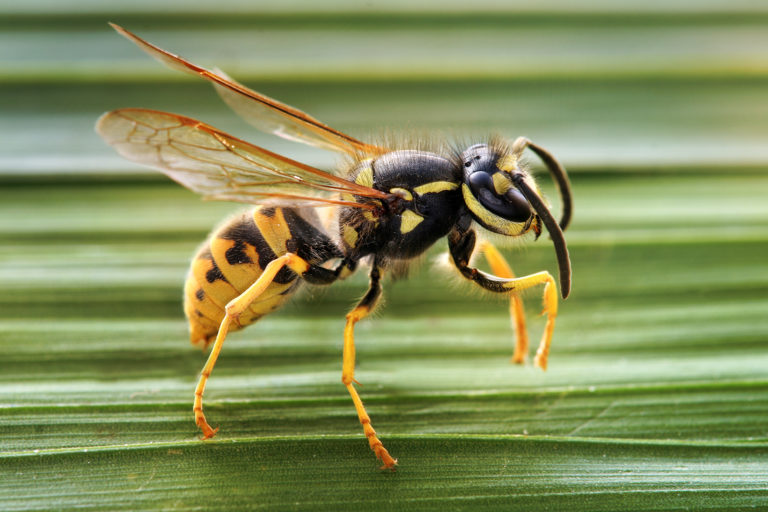
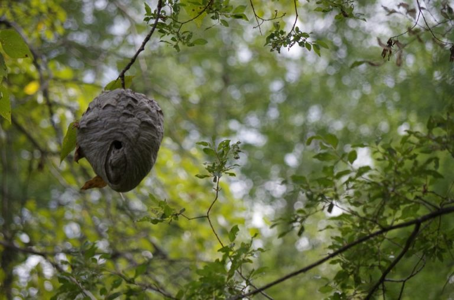
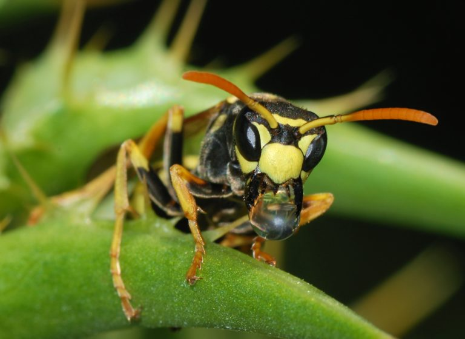

Les guêpes font partie des insectes que l’on classe souvent dans la catégorie des nuisibles. Elles se cachent généralement dans nos jardins et y construisent leur nid. Ce qui peut très rapidement devenir un cauchemar et nécessiter une désinsectisation par un professionnel comme Parasystem.

Par conséquent, pour ne pas avoir à se battre contre une guêpe pendant un barbecue sous 35 degré dans votre jardin, il est essentiel de savoir comment éviter d’avoir des guêpes ou si elles sont déjà présentes, comment s’en débarrasser.

## Qu’est-ce qu’une guêpe et quels sont les différents types de guêpes ?

Incluses dans la famille des Hyménoptères, les guêpes sont des insectes ayant 4 ailes plus ou moins translucides et dont la paire postérieure est plus petite. Les deux paires d’ailes sont reliées par une structure dotée de crochets appelé le rétinacle.

Les autres caractéristiques des guêpes sont les suivantes : un appareil buccal de type broyeur-lécheur, un dard qui leur permet de piquer et transférer un venin et enfin leur métamorphose est complète (œuf-larve-nymphe-adulte).

A travers le monde, on compte plus de 200 000 espèces de guêpes. Elles peuvent être classées en deux catégories :

- les **guêpes solitaires** qui vivent et travaillent seules
- les **guêpes sociales** qui construisent des nids. Nous allons nous intéresser particulièrement aux guêpes sociales puisque ce sont elles qui nous entourent tout au long de l’été.

Dans la catégorie guêpes sociales, on distingue :

- **Les Vespula** : subdivisées en V. Vulgaris (guêpe commune, c’est elle qui peuple nos tables estivales) et V. Germanica (guêpe germanique)
- **Les Polistes** : subdivisées en P. Gallicus (guêpe gauloise) et P. Dominula
- **Les Dolichovespula** : composées principalement de D. Sylvestris (guêpe des bois)
- **Les Vespa** : subdivisées en V. Crabro (frelon européen) et V. Velutina (frelon asiatique).
- **Les guêpes** sont noires et jaunes et mesurent entre 10 et 25 mm. Elles se nourrissent surtout de matières sucrées (fruits mûrs, sève, nectar etc.).

Les guêpes sont noires et jaunes et mesurent entre 10 et 25 mm. Elles se nourrissent surtout de matières sucrées (fruits mûrs, sève, nectar etc.).

## Quel est le mode de vie des guêpes ?

Comme évoqué précédemment, une guêpe peut être qualifiée de solitaire. Ce type de guêpe vit et travaille seule, elle ne construit pas de nid. La guêpe solitaire adulte est fertile et pond ses œufs dans d’autres insectes. Ceci fait d’elle une guêpe parasitaire utilisée en lutte biologique pour parasiter d’autres insectes nuisibles.

Quant aux guêpes sociales, elles vivent en colonies. Elles construisent un nid plus ou moins élaboré pouvant contenir plusieurs milliers d’individus. L’organisation de la colonie est hiérarchisée. On y trouve une ou plusieurs reines, des ouvrières stériles, des mâles.

Au début de l’année, généralement en Avril, la jeune reine construit le début d’un nid après la période d’hibernation. Elle y pondra les premiers œufs qui donneront les ouvrières (des femelles stériles). Cette première génération d’ouvrières prendra le relai de la reine dans toutes ses tâches sauf la reproduction.

Vers août/septembre, une partie des larves se transforme en spécimens mâles et femelles fertiles qui quitteront le nid pour aller s’accoupler. Les mâles meurent peu après l’accouplement. Lors des premières nuits froides, toutes les guêpes meurent à l’exception des jeunes reines accouplées qui trouveront un endroit sécurisé pour passer l’hiver.

## Où vivent les guêpes et qu’est-ce qui les attire ?

Les guêpes sont des insectes imprévisibles qui peuvent s’adapter à tous les types d’environnement. Elles arrivent à vivre dans les endroits les plus improbables. Vous pouvez trouver des nids de guêpe dans le sol, dans des murs creux, dans le grenier ou encore dans un tronc d’arbre, etc.

Elles sont attirées par les fruits mûrs, les bouteilles vides (bière, vin, jus de fruit) ou encore les détritus. Il est donc préférable de vous débarrasser de poubelles et bouteilles vides afin d’éviter les mauvaises surprises et de conserver dans des films alimentaires vos fruits.

## Comment se forment les nids de guêpes ?

Les nids de guêpes sont construits par elles-mêmes. Pour ce faire, elles partent à la quête de cellulose qu’elles récoltent en rognant de façon très superficielle du vieux bois et de l’écorce de jeunes rameaux. Elles mélangent cette cellulose avec leur salive, une pâte est obtenue. En se durcissant, elle devient un matériau gris ou brun jaunâtre ressemblant à du papier.

Le nid a généralement une forme sphérique, il est constitué d’un axe central appelé pédicelle par lequel il est suspendu et d’un nombre variable de rayons disposés horizontalement et composés d’une couche unique de cellules hexagonales. Il faut savoir que les nids sont annuels et ne sont plus réoccupés une autre année.

## Comment se débarrasser des nids de guêpes ?

Pour se débarrasser des nids de guêpes soi-même, veillez à vous couvrir toutes les parties du corps. Même le visage doit être couvert. Ensuite, entamez l’opération pendant la nuit, les risques de piqûres sont réduits en cette période.

N’utilisez ni torche ni lanterne. Puis, munissez-vous d’un sac poubelle. Habilement, recouvrez le nid, détachez-le de l’endroit où il est posé et fermez le sac. Vous pouvez pulvériser le nid avec de l’insecticide avant de l’ôter. Enfin, jetez le sac dans une poubelle fermée loin de chez vous.

Sinon, vous pouvez faire appel à un professionnel. C’est d’ailleurs la meilleure solution car il est mieux équipé et possède une connaissance approfondie en la matière

## Pourquoi les guêpes se montrent-elles parfois agressives ?

Les guêpes sont agressives et peuvent devenir gênantes lorsque leur nid se situe à proximité d’une habitation ou d’une zone souvent fréquentée. L’agressivité est liée à un système de défense inné, les guêpes sont de nature très protectrices. Elles sont très sensibles au bruit, comme celui de la vibration d’un moteur ou des pas.

Ainsi, dès qu’il y a bruit, les ouvrières qui tiennent le rôle de gardiennes quittent le nid et foncent vers tout être vivant ou tout objet en mouvement. Toutefois, elles veillent à ne pas s’éloigner de plus de sept mètres du guêpier.

## Que faire en cas de piqûre d’une abeille ?

En vous piquant, l’abeille laisse le dard sous votre peau. La première étape à faire est de retirer celui-ci. Veillez à ne pas le presser, munissez-vous d’une pince. Le venin risque de provoquer une douleur assez intense. Afin d’attendrir cela, posez-y une noix de dentifrice. Vous pouvez avoir recours aux lotions pour le traitement des piqûres d’abeilles également. Afin de ralentir la propagation du venin, posez de la glace sur la piqûre pendant au moins 20 minutes. Prenez des antihistaminiques afin d’éviter toutes réactions allergiques.